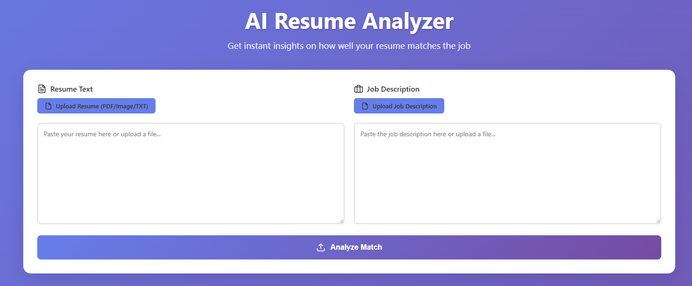
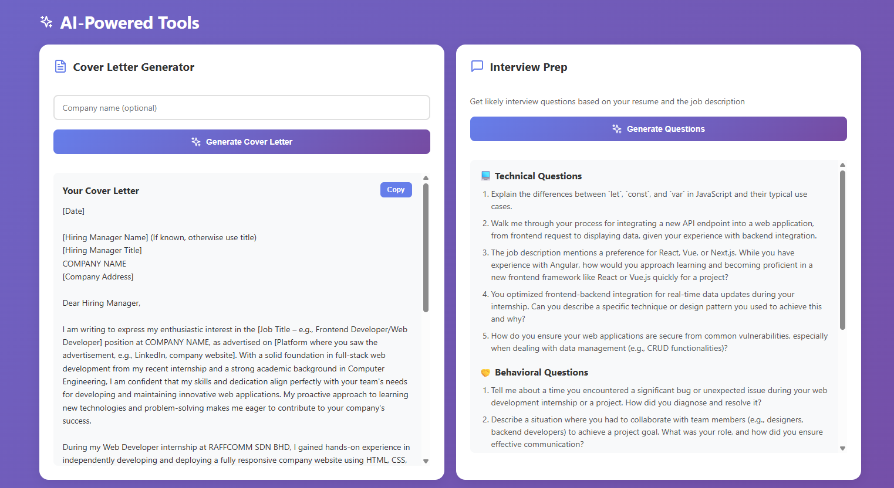

# AI Resume Analyzer Dashboard

A React dashboard that analyzes resumes against job descriptions using AI to provide:
- Match score calculation
- Missing skills identification
- Resume improvement suggestions
- Strengths & weaknesses analysis
- Keyword matching

## Setup

### Install Dependencies

```bash
# Install frontend dependencies
npm install

# Install backend dependencies
cd server
npm install
cd ..
```

### Configure OpenAI API

1. Create a `.env` file in the `server/` directory:
```bash
cd server
cp .env.example .env
```

2. Add your OpenAI API key to `.env`:
```
OPENAI_API_KEY=sk-your-api-key-here
PORT=3001
```

3. Get your API key from [OpenAI Platform](https://platform.openai.com/api-keys)

### Run the Application

**Terminal 1 - Start Backend Server:**
```bash
cd server
npm start
```

**Terminal 2 - Start Frontend:**
```bash
npm run dev
```

The frontend will run on `http://localhost:5173` and the backend on `http://localhost:3001`.

**Note:** AI features require an OpenAI API key. Without it, the app falls back to rule-based analysis.

## Features

### Core Analysis
- 📊 Visual match score with circular progress
- 🎯 Missing skills detection
- 💡 Actionable improvement suggestions
- ✅ Strengths and weaknesses breakdown
- 🔍 Keyword analysis (matched vs missing)
- 📱 Responsive design
- 📄 File upload support (PDF, Images, TXT)
- 🔍 OCR text extraction from images
- 📥 Export analysis reports

### AI-Powered Features (OpenAI GPT-4)
- 🤖 **Semantic Analysis** - Understands context, not just keywords
- 📝 **Cover Letter Generator** - Creates personalized cover letters
- 💬 **Interview Prep** - Generates likely interview questions (technical, behavioral, role-specific)
- ✨ **Tone Analysis** - Assesses professionalism and confidence
- 🎯 **ATS Compatibility Check** - Evaluates resume formatting for ATS systems
- 🧠 **Intelligent Suggestions** - Context-aware improvement recommendations

## Usage

1. **Option A:** Paste your resume text in the left textarea
2. **Option B:** Click "Upload Resume" to upload PDF, image (PNG/JPG), or TXT file
3. Do the same for job description
4. Click "Analyze Match"
5. View comprehensive analysis results
6. Export report if needed

### Supported File Types
- PDF documents (.pdf)
- Images (.png, .jpg, .jpeg) - OCR powered by Tesseract.js
- Text files (.txt)

### AI Features Usage

After analyzing your resume, scroll down to access:

1. **Cover Letter Generator**
   - Optionally enter company name
   - Click "Generate Cover Letter"
   - Copy and customize as needed

2. **Interview Prep**
   - Click "Generate Questions"
   - Get technical, behavioral, and role-specific questions
   - Practice your answers before the interview

## Integration

The app includes two analysis modes:

### AI-Powered Analysis (with OpenAI API key)
- Semantic understanding of resume content
- Context-aware suggestions
- Tone and professionalism assessment
- ATS compatibility evaluation
- Intelligent keyword matching

### Rule-Based Analysis (fallback)
- Keyword extraction and matching
- Skill identification (50+ common tech skills)
- Experience and education parsing
- Quantifiable achievement detection
- Match score calculation

### API Endpoints

```javascript
// Analyze resume
POST http://localhost:3001/api/analyze
{
  "resume": "text...",
  "jobDescription": "text...",
  "useAI": true
}

// Generate cover letter
POST http://localhost:3001/api/generate-cover-letter
{
  "resume": "text...",
  "jobDescription": "text...",
  "companyName": "optional"
}

// Generate interview questions
POST http://localhost:3001/api/generate-interview-questions
{
  "resume": "text...",
  "jobDescription": "text..."
}
```
